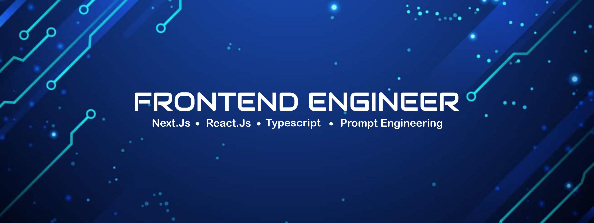

<h1 align="left">Hi 👋, I'm Emmanuel</h1>

  Frontend Engineer based in <strong>Ibadan, Nigeria</strong> 🇳🇬  
  I build clean, scalable, and user-focused web applications using modern frontend technologies.

---

## 👨‍💻 About Me

I’m a passionate **Frontend Developer** who enjoys transforming ideas into polished digital experiences.  
My focus is on **performance, accessibility, and maintainable UI architecture**, with a strong bias toward modern React ecosystems.

- 💻 As a Frontend Developer, I have built production-ready applications using **React and Next.js**, focusing on scalable UI architecture, performance, and maintainability.
- 📱 I am currently expanding my skill set into **React Native**, applying my existing frontend knowledge to build cross-platform mobile applications.
- ⚙️ Experienced in **state management, API integration, and authentication flows** across both web and mobile environments.
- 🧩 Strong emphasis on **reusable components, clean UI patterns, and developer-friendly codebases**.
- 🧠 Continuously learning and adapting to best practices across the React ecosystem.

---

## 🔧 Tools & Technologies

  
  
  
  
  
  
  
  
  
  

  
  

---

## 🌐 Portfolio & Links

- 👨‍💻 Portfolio: **https://emmanuel-developer.vercel.app/**
- 🐙 GitHub: **https://github.com/Royal-design**
- 💼 LinkedIn: **https://www.linkedin.com/in/emmanuel-olowookere-869262216/**
- 📫 Email: **olowookereoluwaseun25@gmail.com**

  
  
  

---

## 📊 GitHub Stats

  

---

  <em>“Great UI is invisible. Great UX is unforgettable.”</em>

