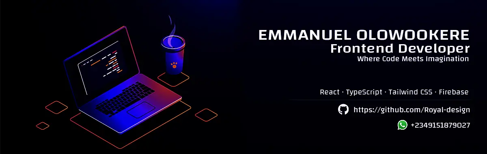

 <h1 style="margin: 0;">Hi 👋, I'm EMMANUEL</h1>
  

    I am a frontend developer based in Ibadan, Nigeria, where I turn ideas into web reality with a passion for creating beautiful and functional web applications. My love for technology drives me to stay ahead of the curve, always learning and embracing new possibilities.
  

---

### 🔧 Tech Stacks & Tools

---

### 🌐 Socials

  
  
  

---

### 📊 GitHub Stats

---

### 🚀 About Me

- 🌱 I’m currently deepening my knowledge in **Next.js**, focusing on server-side rendering (SSR), static site generation (SSG), API routes, authentication, and performance optimization. I’m also exploring the **App Router**, middleware, and advanced routing features introduced in the latest versions.
- 💼 I enjoy working with modern stacks like **React, TypeScript, TailwindCSS, Redux, and Firebase** and I'm passionate about building scalable and maintainable frontend architectures.
- 👨‍💻 Check out my projects and live demos at [my portfolio](https://emmanuel-dev-portfolio.vercel.app/).
- 💬 I love talking about clean UI, state management, API integration, Git workflows, and building **reusable, performant components**.
- 🧠 I continuously stay updated with best practices, dev tools, and new features in the React ecosystem.
- 📫 Reach me any time via [royaldesign1999@gmail.com](mailto:royaldesign1999@gmail.com)

---
