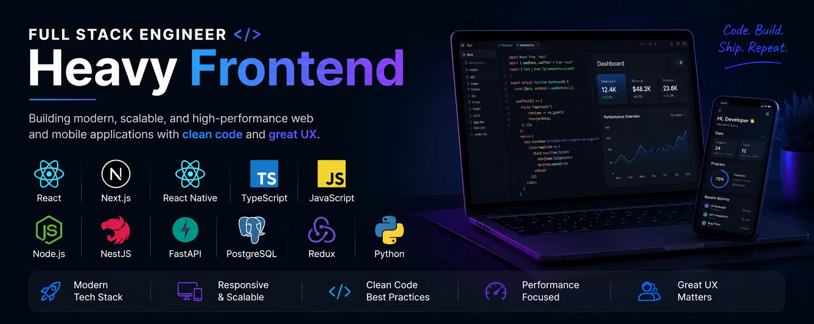

<h1 align="left">Hi 👋, I'm Emmanuel</h1>

  <strong>Full Stack Engineer (Heavy Frontend)</strong> based in <strong>Ibadan, Nigeria</strong> 🇳🇬  
  I build modern, scalable, and high-performance web and mobile applications with a strong focus on exceptional user experiences.

  

---

## 👨‍💻 About Me

I'm a **Full Stack Engineer with a strong frontend focus**, passionate about transforming ideas into polished digital experiences.

My expertise lies in building scalable frontend architectures while also developing robust backend APIs and services.

- 💻 Built production-ready applications using **React, Next.js, TypeScript, and modern frontend ecosystems**.
- 📱 Building cross-platform mobile applications with **React Native and Expo**.
- ⚙️ Developing scalable backend APIs using **Node.js, Express.js, NestJS, and FastAPI**.
- 🗄️ Experienced with **PostgreSQL, MongoDB, Firebase, and database design**.
- 🔐 Strong understanding of **authentication, authorization, API integration, and state management**.
- 🧩 Passionate about **clean architecture, reusable components, accessibility, and performance optimization**.
- 🚀 Continuously learning and exploring modern web technologies and software engineering best practices.

---

## 🚀 Current Focus

- 🔥 Building scalable applications with **Next.js App Router**
- 📱 Developing mobile apps using **React Native + Expo**
- ⚡ Learning advanced backend architecture with **NestJS and FastAPI**
- 🐳 Exploring **Docker, CI/CD, and cloud deployment**

---

## 🔧 Tools & Technologies

<!-- Frontend -->

<!-- Backend -->

<!-- Database -->

<!-- Styling -->

<!-- State -->

<!-- Tools -->

---

## 🌐 Portfolio & Links

---

## 📊 GitHub Stats

  

---

  <em>"Great UI is invisible. Great UX is unforgettable."</em>

